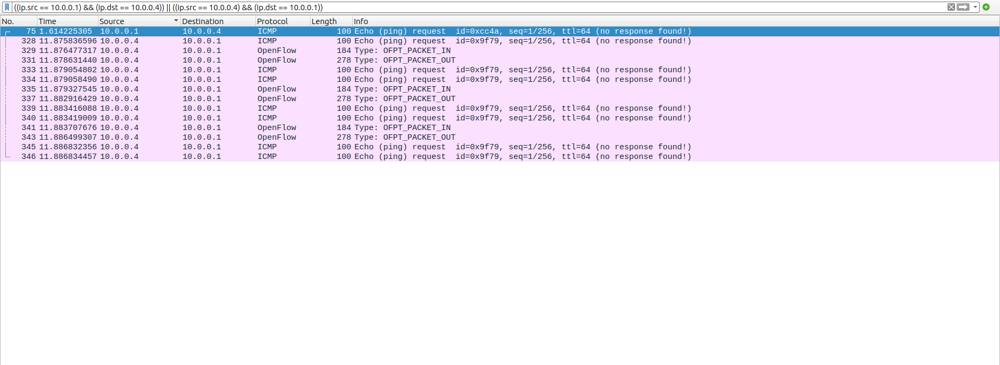
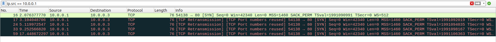
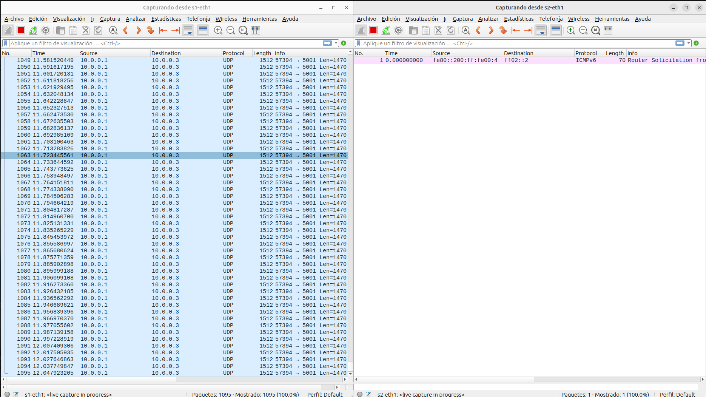

# Preguntas a responder
1. ¿Cuál es la diferencia entre un Switch y un router? ¿Qué tienen en común?
    * El objetivo principal de un router es conectar varias redes simultáneamente (se utiliza en el núcleo de la red) y se considera que es un dispositivo que trabaja en la capa de red. En cambio, un switch permite que distintos dispositivos conectados puedan compartir información sin importar su localización dentro de un edificio o campus (se utiliza en redes de acceso). Se considera que un switch trabaja en la capa de enlace. Lo que tienen en común es que ambos son dispositivos que toman los paquetes recibidos mediante sus puertos de entrada y los envían por aquellos puertos de salida que les permitan llegar a sus respectivos destinos finales.
2. ¿Cuál es la diferencia entre un Switch convencional y un Switch OpenFlow?
    * En uno convencional, el plano de datos y de control se encuentran implementados y funcionan en el mismo dispositivo. En cambio, en un switch OpenFlow sólo se ejecutarán acciones propias del plano de datos. Todas las funciones características del plano de control (cálculo de tablas de flujo, etc.) son llevadas a cabo por un dispositivo externo llamado controller. Es con este último con quien el switch mantiene una comunicación constante mediante mensajes propios del protocolo.
3. ¿Se pueden reemplazar todos los routers de la Intenet por Switches OpenFlow? Piense en el escenario interASes para elaborar su respuesta
	* No lo reemplazariamos por las siguientes dos razones:
		1. Eficiencia. Los routes que no requieren tanta lógica/funcionalidad es mejor que estén implementados en hardware ya que su tiempo de procesamiento es ordenes de magnitud más rápido. Por lo que si todos fuesen switches openflow toda la red estaría mucho más congestionada.
		2. Protocolos InterASes: los switches openflow (por lo menos el POX) no implementan los protocolos BGP y OSPF, por lo que sería imposible poder dar a conocer direcciones en una red que solo tenga switches openflow. Con esto entendemos que no hay un controlador lo suficientemente amplio como para que cumpla con todos los requerimientos que se pueden presentar en TODO Internet.
  

# Simulación
Para la simulacion usamos las siguientes herramientas y agregaremos tambien una pequeña descripcion de lo que hace cada una.  
* **Mininet**: Mininet es una plataforma de emulación de redes de código abierto que permite crear una red virtual completa para fines de prueba y desarrollo. En este trabajo lo hemos utilizado con el fin de simular los switches OpenFlow.
* **POX**: POX es un controlador de red de código abierto diseñado para implementar y desarrollar redes definidas por software (SDN). Aqui fue utilizado ya que tiene integracion con OpenFlow lo que permite dar al controlador la posibilidad de decidir sobre el flujo de la red.  
* **Wireshark**: Wireshark es una herramienta de software de código abierto que se utiliza para el análisis y la captura de paquetes en una red.
* **iperf**: iperf es una herramienta de línea de comandos utilizada para medir el rendimiento de la red. Su función principal es evaluar la velocidad y el ancho de banda de una conexión de red entre dos puntos. Puede ser utilizado para abrir un cliente y un servidor en dos hosts diferentes para evaluar el rendimiento de la conexion.


## Firewall deactivated

*Archivo de configuración*
```
{
    "firewall_dpid": -1,
    "host1_ip": "10.0.0.1",
    "banned_ip1": "10.0.0.1",
    "banned_ip2": "10.0.0.4"
}
```  

*Output mininet*

```
mininet> pingall
*** Ping: testing ping reachability
lh1 -> lh2 rh1 rh2 
lh2 -> lh1 rh1 rh2 
rh1 -> lh1 lh2 rh2 
rh2 -> lh1 lh2 rh1 
*** Results: 0% dropped (12/12 received)
```

## Firewall activated

*Archivo de configuración*
```
{
    "firewall_dpid": 1,
    "host1_ip": "10.0.0.1",
    "banned_ip1": "10.0.0.1",
    "banned_ip2": "10.0.0.4"
}
```


*Pingall*
```
mininet> pingall
*** Ping: testing ping reachability
lh1 -> lh2 rh1 X 
lh2 -> lh1 rh1 rh2 
rh1 -> lh1 lh2 rh2 
rh2 -> X lh2 rh1 
*** Results: 16% dropped (10/12 received)
```

*Output POX*
```
DEBUG:core:POX 0.3.0 (dart) going up...
DEBUG:core:Running on CPython (2.7.18/Jul 1 2022 10:30:50)
DEBUG:core:Platform is Linux-5.15.0-88-generic-x86_64-with-LinuxMint-21.1-vera
INFO:core:POX 0.3.0 (dart) is up.
DEBUG:openflow.of_01:Listening on 0.0.0.0:6633
INFO:openflow.of_01:[00-00-00-00-00-01 2] connected
DEBUG:firewall:El switch 1 es el firewall
DEBUG:forwarding.l2_learning:Connection [00-00-00-00-00-01 2]
INFO:openflow.of_01:[00-00-00-00-00-04 3] connected
DEBUG:forwarding.l2_learning:Connection [00-00-00-00-00-04 3]
INFO:openflow.of_01:[00-00-00-00-00-03 4] connected
DEBUG:forwarding.l2_learning:Connection [00-00-00-00-00-03 4]
INFO:openflow.of_01:[00-00-00-00-00-02 5] connected
DEBUG:forwarding.l2_learning:Connection [00-00-00-00-00-02 5]
DEBUG:openflow.of_01:1 connection aborted
DEBUG:forwarding.l2_learning:installing flow for 00:00:00:00:00:01.1 -> 00:00:00:00:00:03.3
DEBUG:forwarding.l2_learning:installing flow for 00:00:00:00:00:01.1 -> 00:00:00:00:00:03.3
DEBUG:forwarding.l2_learning:installing flow for 00:00:00:00:00:01.1 -> 00:00:00:00:00:03.3
DEBUG:forwarding.l2_learning:installing flow for 00:00:00:00:00:01.1 -> 00:00:00:00:00:03.2
DEBUG:forwarding.l2_learning:installing flow for 00:00:00:00:00:01.1 -> 00:00:00:00:00:03.2
DEBUG:forwarding.l2_learning:installing flow for 00:00:00:00:00:01.1 -> 00:00:00:00:00:03.2
DEBUG:forwarding.l2_learning:installing flow for 00:00:00:00:00:01.1 -> 00:00:00:00:00:03.2
DEBUG:forwarding.l2_learning:installing flow for 00:00:00:00:00:01.1 -> 00:00:00:00:00:03.2
DEBUG:forwarding.l2_learning:installing flow for 00:00:00:00:00:01.1 -> 00:00:00:00:00:03.2
DEBUG:forwarding.l2_learning:installing flow for 00:00:00:00:00:01.3 -> 00:00:00:00:00:03.1
DEBUG:forwarding.l2_learning:installing flow for 00:00:00:00:00:01.1 -> 00:00:00:00:00:03.2
DEBUG:forwarding.l2_learning:installing flow for 00:00:00:00:00:01.3 -> 00:00:00:00:00:03.1
DEBUG:forwarding.l2_learning:installing flow for 00:00:00:00:00:01.1 -> 00:00:00:00:00:03.2
DEBUG:forwarding.l2_learning:installing flow for 00:00:00:00:00:01.3 -> 00:00:00:00:00:03.1
DEBUG:forwarding.l2_learning:installing flow for 00:00:00:00:00:03.1 -> 00:00:00:00:00:01.3
DEBUG:forwarding.l2_learning:installing flow for 00:00:00:00:00:03.1 -> 00:00:00:00:00:01.3
DEBUG:forwarding.l2_learning:installing flow for 00:00:00:00:00:03.2 -> 00:00:00:00:00:01.1
DEBUG:forwarding.l2_learning:installing flow for 00:00:00:00:00:03.2 -> 00:00:00:00:00:01.1
DEBUG:forwarding.l2_learning:installing flow for 00:00:00:00:00:03.2 -> 00:00:00:00:00:01.1
DEBUG:forwarding.l2_learning:installing flow for 00:00:00:00:00:03.2 -> 00:00:00:00:00:01.1
DEBUG:forwarding.l2_learning:installing flow for 00:00:00:00:00:03.3 -> 00:00:00:00:00:01.1
DEBUG:forwarding.l2_learning:installing flow for 00:00:00:00:00:03.3 -> 00:00:00:00:00:01.1
DEBUG:forwarding.l2_learning:installing flow for 00:00:00:00:00:03.2 -> 00:00:00:00:00:01.1
DEBUG:forwarding.l2_learning:installing flow for 00:00:00:00:00:03.3 -> 00:00:00:00:00:01.1
DEBUG:forwarding.l2_learning:installing flow for 00:00:00:00:00:01.1 -> 00:00:00:00:00:03.3
DEBUG:forwarding.l2_learning:installing flow for 00:00:00:00:00:03.3 -> 00:00:00:00:00:01.1
DEBUG:forwarding.l2_learning:installing flow for 00:00:00:00:00:01.1 -> 00:00:00:00:00:03.3
DEBUG:forwarding.l2_learning:installing flow for 00:00:00:00:00:01.1 -> 00:00:00:00:00:03.2
DEBUG:forwarding.l2_learning:installing flow for 00:00:00:00:00:01.1 -> 00:00:00:00:00:03.2
DEBUG:forwarding.l2_learning:installing flow for 00:00:00:00:00:01.1 -> 00:00:00:00:00:03.2
DEBUG:forwarding.l2_learning:installing flow for 00:00:00:00:00:01.1 -> 00:00:00:00:00:03.2
DEBUG:forwarding.l2_learning:installing flow for 00:00:00:00:00:01.1 -> 00:00:00:00:00:03.2
DEBUG:forwarding.l2_learning:installing flow for 00:00:00:00:00:01.3 -> 00:00:00:00:00:03.1
DEBUG:forwarding.l2_learning:installing flow for 00:00:00:00:00:01.3 -> 00:00:00:00:00:03.1
DEBUG:forwarding.l2_learning:installing flow for 00:00:00:00:00:01.3 -> 00:00:00:00:00:03.1
DEBUG:forwarding.l2_learning:installing flow for 00:00:00:00:00:01.1 -> 00:00:00:00:00:02.2
DEBUG:forwarding.l2_learning:installing flow for 00:00:00:00:00:02.2 -> 00:00:00:00:00:01.1
DEBUG:forwarding.l2_learning:installing flow for 00:00:00:00:00:01.1 -> 00:00:00:00:00:03.3
DEBUG:forwarding.l2_learning:installing flow for 00:00:00:00:00:01.1 -> 00:00:00:00:00:03.2
DEBUG:forwarding.l2_learning:installing flow for 00:00:00:00:00:01.1 -> 00:00:00:00:00:03.2
DEBUG:forwarding.l2_learning:installing flow for 00:00:00:00:00:01.3 -> 00:00:00:00:00:03.1
DEBUG:forwarding.l2_learning:installing flow for 00:00:00:00:00:03.1 -> 00:00:00:00:00:01.3
DEBUG:forwarding.l2_learning:installing flow for 00:00:00:00:00:03.2 -> 00:00:00:00:00:01.1
DEBUG:forwarding.l2_learning:installing flow for 00:00:00:00:00:03.2 -> 00:00:00:00:00:01.1
DEBUG:forwarding.l2_learning:installing flow for 00:00:00:00:00:03.3 -> 00:00:00:00:00:01.1
DEBUG:forwarding.l2_learning:installing flow for 00:00:00:00:00:02.2 -> 00:00:00:00:00:01.1
DEBUG:forwarding.l2_learning:installing flow for 00:00:00:00:00:01.1 -> 00:00:00:00:00:02.2
DEBUG:forwarding.l2_learning:installing flow for 00:00:00:00:00:02.2 -> 00:00:00:00:00:03.3
DEBUG:forwarding.l2_learning:installing flow for 00:00:00:00:00:02.1 -> 00:00:00:00:00:03.2
DEBUG:forwarding.l2_learning:installing flow for 00:00:00:00:00:02.1 -> 00:00:00:00:00:03.2
DEBUG:forwarding.l2_learning:installing flow for 00:00:00:00:00:02.3 -> 00:00:00:00:00:03.1
DEBUG:forwarding.l2_learning:installing flow for 00:00:00:00:00:03.1 -> 00:00:00:00:00:02.3
DEBUG:forwarding.l2_learning:installing flow for 00:00:00:00:00:03.2 -> 00:00:00:00:00:02.1
DEBUG:forwarding.l2_learning:installing flow for 00:00:00:00:00:03.2 -> 00:00:00:00:00:02.1
DEBUG:forwarding.l2_learning:installing flow for 00:00:00:00:00:03.3 -> 00:00:00:00:00:02.2
DEBUG:forwarding.l2_learning:installing flow for 00:00:00:00:00:02.2 -> 00:00:00:00:00:04.3
DEBUG:forwarding.l2_learning:installing flow for 00:00:00:00:00:02.1 -> 00:00:00:00:00:04.2
DEBUG:forwarding.l2_learning:installing flow for 00:00:00:00:00:02.1 -> 00:00:00:00:00:04.2
DEBUG:forwarding.l2_learning:installing flow for 00:00:00:00:00:02.3 -> 00:00:00:00:00:04.2
DEBUG:forwarding.l2_learning:installing flow for 00:00:00:00:00:04.2 -> 00:00:00:00:00:02.3
DEBUG:forwarding.l2_learning:installing flow for 00:00:00:00:00:04.2 -> 00:00:00:00:00:02.1
DEBUG:forwarding.l2_learning:installing flow for 00:00:00:00:00:04.2 -> 00:00:00:00:00:02.1
DEBUG:forwarding.l2_learning:installing flow for 00:00:00:00:00:04.3 -> 00:00:00:00:00:02.2
DEBUG:forwarding.l2_learning:installing flow for 00:00:00:00:00:03.1 -> 00:00:00:00:00:01.3
DEBUG:forwarding.l2_learning:installing flow for 00:00:00:00:00:03.2 -> 00:00:00:00:00:01.1
DEBUG:forwarding.l2_learning:installing flow for 00:00:00:00:00:03.2 -> 00:00:00:00:00:01.1
DEBUG:forwarding.l2_learning:installing flow for 00:00:00:00:00:03.3 -> 00:00:00:00:00:01.1
DEBUG:forwarding.l2_learning:installing flow for 00:00:00:00:00:01.1 -> 00:00:00:00:00:03.3
DEBUG:forwarding.l2_learning:installing flow for 00:00:00:00:00:01.1 -> 00:00:00:00:00:03.2
DEBUG:forwarding.l2_learning:installing flow for 00:00:00:00:00:01.1 -> 00:00:00:00:00:03.2
DEBUG:forwarding.l2_learning:installing flow for 00:00:00:00:00:01.3 -> 00:00:00:00:00:03.1
DEBUG:forwarding.l2_learning:installing flow for 00:00:00:00:00:03.1 -> 00:00:00:00:00:02.3
DEBUG:forwarding.l2_learning:installing flow for 00:00:00:00:00:03.2 -> 00:00:00:00:00:02.1
DEBUG:forwarding.l2_learning:installing flow for 00:00:00:00:00:03.2 -> 00:00:00:00:00:02.1
DEBUG:forwarding.l2_learning:installing flow for 00:00:00:00:00:03.3 -> 00:00:00:00:00:02.2
DEBUG:forwarding.l2_learning:installing flow for 00:00:00:00:00:02.2 -> 00:00:00:00:00:03.3
DEBUG:forwarding.l2_learning:installing flow for 00:00:00:00:00:02.1 -> 00:00:00:00:00:03.2
DEBUG:forwarding.l2_learning:installing flow for 00:00:00:00:00:02.1 -> 00:00:00:00:00:03.2
DEBUG:forwarding.l2_learning:installing flow for 00:00:00:00:00:02.3 -> 00:00:00:00:00:03.1
DEBUG:forwarding.l2_learning:installing flow for 00:00:00:00:00:03.1 -> 00:00:00:00:00:04.2
DEBUG:forwarding.l2_learning:installing flow for 00:00:00:00:00:04.2 -> 00:00:00:00:00:03.1
DEBUG:forwarding.l2_learning:installing flow for 00:00:00:00:00:04.2 -> 00:00:00:00:00:01.3
DEBUG:forwarding.l2_learning:installing flow for 00:00:00:00:00:04.2 -> 00:00:00:00:00:01.1
DEBUG:forwarding.l2_learning:installing flow for 00:00:00:00:00:04.2 -> 00:00:00:00:00:01.1
DEBUG:forwarding.l2_learning:installing flow for 00:00:00:00:00:04.2 -> 00:00:00:00:00:02.3
DEBUG:forwarding.l2_learning:installing flow for 00:00:00:00:00:04.2 -> 00:00:00:00:00:02.1
DEBUG:forwarding.l2_learning:installing flow for 00:00:00:00:00:04.2 -> 00:00:00:00:00:02.1
DEBUG:forwarding.l2_learning:installing flow for 00:00:00:00:00:04.3 -> 00:00:00:00:00:02.2
DEBUG:forwarding.l2_learning:installing flow for 00:00:00:00:00:02.2 -> 00:00:00:00:00:04.3
DEBUG:forwarding.l2_learning:installing flow for 00:00:00:00:00:02.1 -> 00:00:00:00:00:04.2
DEBUG:forwarding.l2_learning:installing flow for 00:00:00:00:00:02.1 -> 00:00:00:00:00:04.2
DEBUG:forwarding.l2_learning:installing flow for 00:00:00:00:00:02.3 -> 00:00:00:00:00:04.2
DEBUG:forwarding.l2_learning:installing flow for 00:00:00:00:00:04.2 -> 00:00:00:00:00:03.1
DEBUG:forwarding.l2_learning:installing flow for 00:00:00:00:00:03.1 -> 00:00:00:00:00:04.2
INFO:openflow.of_01:[00-00-00-00-00-01 2] closed
INFO:openflow.of_01:[00-00-00-00-00-04 3] closed
INFO:openflow.of_01:[00-00-00-00-00-03 4] closed
INFO:openflow.of_01:[00-00-00-00-00-02 5] closed
INFO:core:Going down...
INFO:core:Down.
```  


*Captura de Wireshark para los hosts 10.0.0.1 y 10.0.0.4*
  
Podemos observar como el firewall no permite la conexion entre ambos puntos ya que se encuentran bloqueados.  

---
*Captura de Wireshark para el host 10.0.0.1 enviando al puerto 80 con iperf*

Aqui vemos que TCP reintenta enviar el paquete ya que nunca recibio el ACK correspondiente, debido a que nunca llego el paquete por la regla del firewall.  

---
*Captura de Wireshark para la regla que corta el trafico al puerto 5001, con protocolo UDP y desde el host 1*

En este caso observamos como no llega al switch 2 el paquete enviado por UDP, desde el host 1 y enviado al puerto 5001 porque el switch 1 actua de firewall y corta el trafico que cumple con la condicion de la regla 